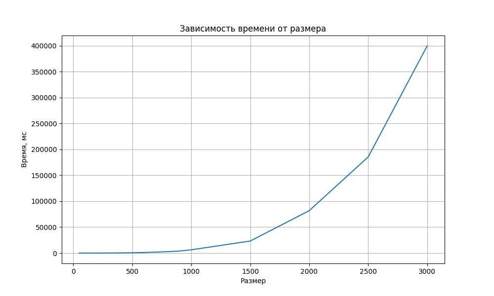

## Отчет по лабораторной работе №1

### Задание на лабораторную работу:
Написать программу на языке C/C++ для перемножения двух матриц.
Исходные данные: файл(ы) содержащие значения исходных матриц.
Выходные данные: файл со значениями результирующей матрицы, время
выполнения, объем задачи.
Обязательна автоматизированная верификация результатов вычислений с помощью
сторонних библиотек или стороннего ПО (например на Matlab/Python).

### Исходный код решения расположен в данном репозитории
* [gen_matrix.h](gen_matrix.h) - библиотека с функциями использующиеся в лабораторных (генерация, запись, чтение, умножение матриц)
* [lab1.cpp](lab1.cpp) - основное задание
* [verify_result.py](verify_result.py) - модуль с функцией верификации полученный результатов с помощью библиотеки numpy
* [data](data) - папка со всеми сгенерированными матрицами, результатами умножения и графиками
* [stats_1.txt](stats_1.txt) - статистика времени вычисления

### Результаты экспериментов и выводы:
Полученная статистика:

| Размер |      Время, мс |
|-------:|---------------:|
|     50 |         2.9816 |
|    100 |        15.1427 |
|    200 |        61.5129 |
|    300 |        162.092 |
|    400 |        354.399 |
|    500 |        648.409 |
|    600 |        1131.59 |
|    700 |        1856.51 |
|    800 |        2777.44 |
|    900 |        3917.87 |
|   1000 |        6334.43 |
|   1500 |        23263.2 |
|   2000 |        81812.7 |
|   2500 |         185512 |
|   3000 |         399675 |

График:

Вывод: При увеличении размерности матриц, время умножения увеличивается значительно.

Отчет выполнил студент группы 6313-100503D Владимирцев А.Д.