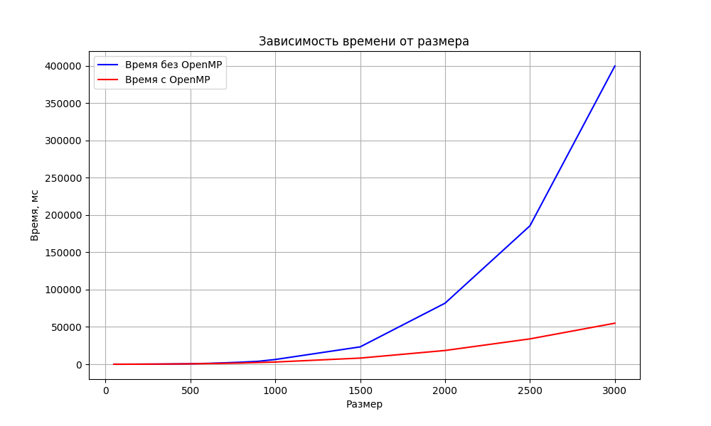

## Отчет по лабораторной работе №2

### Задание на лабораторную работу:
Модифицировать программу из л/р №1 для параллельной работы по технологии OpenMP.

### Исходный код решения расположен в данном репозитории
* [gen_matrix.h](gen_matrix.h) - библиотека с функциями использующиеся в лабораторных (генерация, запись, чтение, умножение матриц(omp))
* [lab2.cpp](lab2.cpp) - основное задание
* [verify_result.py](verify_result.py) - модуль с функцией верификации полученный результатов с помощью библиотеки numpy
* [data](data) - папка со всеми сгенерированными матрицами, результатами умножения и графиками
* [stats_2.txt](stats_2.txt) - статистика времени вычисления

### Результаты экспериментов и выводы:
Полученная статистика:

| Размер | Время, мс |
|-------:|----------:|
|     50 |    2.8131 |
|    100 |   19.9944 |
|    200 |   84.6791 |
|    300 |   192.019 |
|    400 |   353.302 |
|    500 |   566.321 |
|    600 |   865.745 |
|    700 |   1205.43 |
|    800 |   1610.26 |
|    900 |   2322.31 |
|   1000 |   2960.23 |
|   1500 |   8225.81 |
|   2000 |   18434.1 |
|   2500 |   33971.9 |
|   3000 |   55012.4 |

График:

Вывод: OpenMP ускоряет перемножение матриц начиная с размеров 500×500, давая выигрыш почти в 8 раз для больших матриц. На малых размерах (размерностью от 50 до 500) ускорения нет (даже требуется больше времени) из-за накладных расходов на создание потоков и конкуренции за память. По полученным результатам оптимальный порог для использования OpenMP — 500×500.

Отчет выполнил студент группы 6313-100503D Владимирцев А.Д.