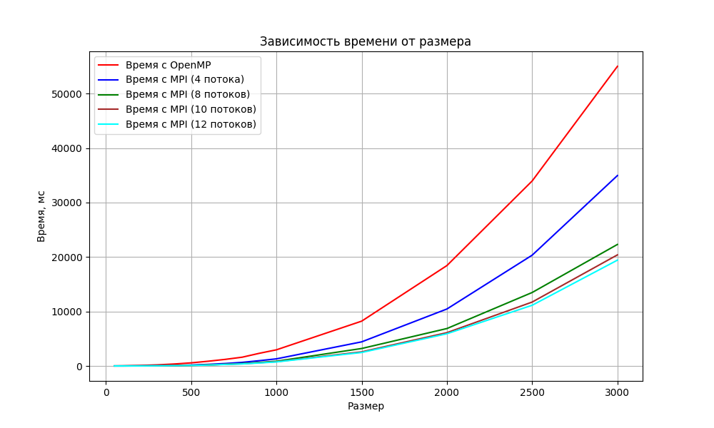

## Отчет по лабораторной работе №3

### Задание на лабораторную работу:
Модифицировать программу из л/р №1 для параллельной работы по технологии MPI.

### Исходный код решения расположен в данном репозитории
* [gen_matrix.h](gen_matrix.h) - библиотека с функциями использующиеся в лабораторных (генерация, запись, чтение, умножение матриц(MPI))
* [lab3.cpp](lab3.cpp) - основное задание
* [verify_result.py](verify_result.py) - модуль с функцией верификации полученный результатов с помощью библиотеки numpy
* [data](data) - папка со всеми сгенерированными матрицами, результатами умножения и графиками
* [stats_3(4).txt](stats_3(4).txt), [stats_3(8).txt](stats_3(8).txt), [stats_3(10).txt](stats_3(10).txt), [stats_3(12).txt](stats_3(12).txt) - статистика времени вычисления используя 4, 8, 10, 12 потоков

### Результаты экспериментов и выводы:

В коде была выполнена редукция для объединения частичных результатов умножения матриц, полученных на разных процессах MPI.

Полученная статистика:

| Размер | Время, мс | OpenMP, мс | MPI (4), мс | MPI (8), мс | MPI (10), мс | MPI (12), мс |
|-------:|----------:|------------|-------------|-------------|--------------|--------------|
|     50 |   12.9816 | 2.8131     | 0.5164      | 0.6123      | 0.5621       | 0.5659       |
|    100 |   15.1427 | 19.9944    | 1.5298      | 1.3018      | 1.0443       | 0.981        |
|    200 |   61.5129 | 84.6791    | 11.3107     | 8.6283      | 8.7351       | 6.8057       |
|    300 |   162.092 | 192.019    | 37.0981     | 27.4253     | 24.4141      | 24.7681      |
|    400 |   354.399 | 353.302    | 80.7114     | 64.3993     | 59.3815      | 57.385       |
|    500 |   648.409 | 566.321    | 163.301     | 114.48      | 99.2745      | 90.9542      |
|    600 |   1131.59 | 865.745    | 288.464     | 195.234     | 185.765      | 161.746      |
|    700 |   1856.51 | 1205.43    | 447.872     | 300.514     | 298.579      | 276.389      |
|    800 |   2777.44 | 1610.26    | 658.728     | 447.061     | 395.681      | 375.546      |
|    900 |   3917.87 | 2322.31    | 967.727     | 648.63      | 586.745      | 546.227      |
|   1000 |   6334.43 | 2960.23    | 1302.37     | 863.058     | 779.861      | 738.224      |
|   1500 |   23263.2 | 8225.81    | 4423.38     | 3202.56     | 2585.51      | 2470.63      |
|   2000 |   81812.7 | 18434.1    | 10458       | 6869.7      | 6109.71      | 5910.85      |
|   2500 |    185512 | 33971.9    | 20342.5     | 13488.5     | 11732.9      | 11143.9      |
|   3000 |    399675 | 55012.4    | 34962.1     | 22311.8     | 20395.8      | 19429.4      |

График:

Вывод: Опытным путем было выявлено, что чем больше потоков тем быстрее происходят вычисления. MPI с 8 потоками обеспечивает значительное ускорение по сравнению с последовательным выполнением и OpenMP, особенно для задач среднего и крупного размера. С ростом объема вычислений MPI демонстрирует лучшую масштабируемость.

Отчет выполнил студент группы 6313-100503D Владимирцев А.Д.